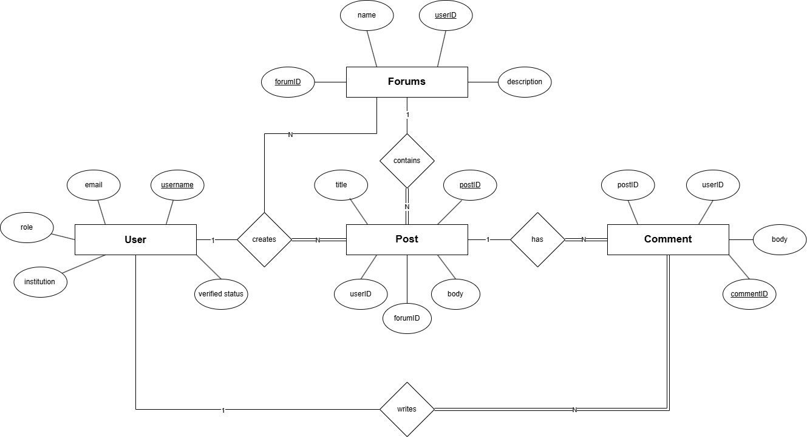
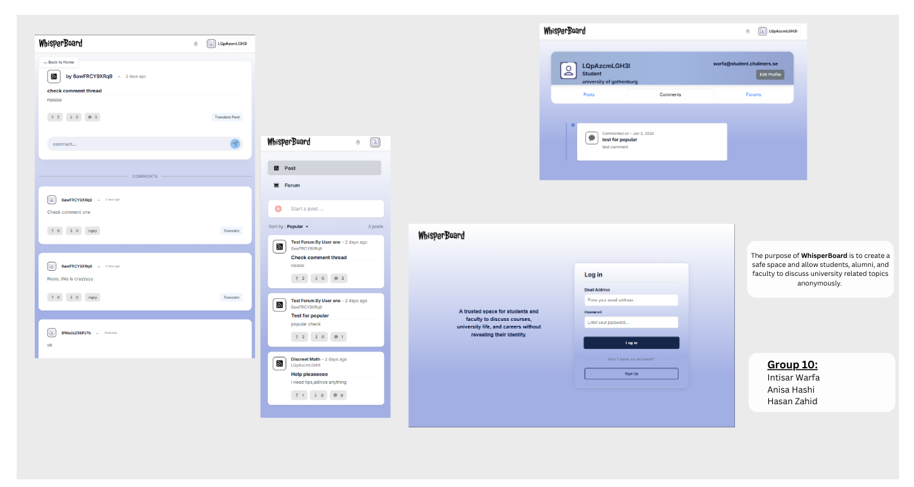

# Backend and Frontend Template

Latest version: https://git.chalmers.se/courses/dit342/group-00-web

This template refers to itself as `group-00-web`. In your project, use your group number in place of `00`.

## Project Structure

| File        | Purpose           | What you do?  |
| ------------- | ------------- | ----- |
| `server/` | Backend server code | All your server code |
| [server/README.md](server/README.md) | Everything about the server | **READ ME** carefully! |
| `client/` | Frontend client code | All your client code |
| [client/README.md](client/README.md) | Everything about the client | **READ ME** carefully! |
| [docs/LOCAL_DEPLOYMENT.md](docs/LOCAL_DEPLOYMENT.md) | Local production deployment | Deploy your app local in production mode |

## Requirements

The version numbers in brackets indicate the tested versions but feel free to use more recent versions.
You can also use alternative tools if you know how to configure them (e.g., Firefox instead of Chrome).

* [Git](https://git-scm.com/) (v2) => [installation instructions](https://www.atlassian.com/git/tutorials/install-git)
  * [Add your Git username and set your email](https://docs.github.com/en/get-started/git-basics/setting-your-username-in-git)
    * `git config --global user.name "YOUR_USERNAME"` => check `git config --global user.name`
    * `git config --global user.email "email@example.com"` => check `git config --global user.email`
  * > **Windows users**: We recommend to use the [Git Bash](https://www.atlassian.com/git/tutorials/git-bash) shell from your Git installation or the Bash shell from the [Windows Subsystem for Linux](https://docs.microsoft.com/en-us/windows/wsl/install-win10) to run all shell commands for this project.
* [Chalmers GitLab](https://git.chalmers.se/) => Login with your **Chalmers CID** choosing "Sign in with" **Chalmers Login**. (contact [support@chalmers.se](mailto:support@chalmers.se) if you don't have one)
  * DIT342 course group: https://git.chalmers.se/courses/dit342
  * [Setup SSH key with Gitlab](https://docs.gitlab.com/user/ssh/#generate-an-ssh-key-pair)
    * Create an SSH key pair `ssh-keygen -t ed25519 -C "email@example.com"` (skip if you already have one)
    * Add your public SSH key to your Gitlab profile under https://git.chalmers.se/-/user_settings/ssh_keys
    * Make sure the email you use to commit is registered under https://git.chalmers.se/-/profile/emails
  * Checkout the [Backend-Frontend](https://git.chalmers.se/courses/dit342/group-00-web) template `git clone git@git.chalmers.se:courses/dit342/group-00-web.git`
* [Server Requirements](./server/README.md#Requirements)
* [Client Requirements](./client/README.md#Requirements)

## Getting started

```bash
# Clone repository
git clone git@git.chalmers.se:courses/dit342/group-00-web.git

# Change into the directory
cd group-00-web

# Setup backend
cd server && npm install
npm run dev

# Setup frontend
cd client && npm install
npm run serve
```

> Check out the detailed instructions for [backend](./server/README.md) and [frontend](./client/README.md).

## Visual Studio Code (VSCode)

Open the `server` and `client` in separate VSCode workspaces or open the combined [backend-frontend.code-workspace](./backend-frontend.code-workspace). Otherwise, workspace-specific settings don't work properly.

## System Definition (MS0)

### Purpose

The Study Life Forum is a platform that allows students, alumni, and faculty to discuss university related topics anonymously. Users can create and participate in forums, make posts, and comment, all while maintaining their anonymity. The system aims to foster open communication, knowledge sharing, and networking within the academic community. It unifies discussions about courses, careers, and general topics.

### Pages

* Home: Displays a list of accessible forums and posts. Users can browse forums, see featured posts, and navigate to specific forums or their profile.
* Forum: Shows all posts within a selected forum. Users can read posts, create new posts, and navigate to individual post pages to view comments.
* Profile: Allows users to manage their account settings, update their password, view their own posts and comments.

### Advanced Feature Proposal
We propose integrating a language translation feature for forum posts and comments, allowing users to toggle content between the original language and their preferred language (English/Swedish). The specific comment or post will be translated only on request and no other module will be affected with the translation. To ensure this qualifies as an advanced feature, we will implement a robust client side caching strategy to optimize performance, reduce latency, and minimize external API costs.

#### Backend Enhancements

* The backend will act as a secure proxy to an external Translation API (Google Translate).
* To prevent data leaks, the backend will strip all request metadata (User IDs, IP addresses, Session Tokens) before forwarding the request. Only the raw text body is sent to the external provider.
* The translated text is returned directly to the frontend and is not permanently stored in our database to reduce storage overhead.
* The user preferred language will be remembered as well and can be updated later on.
* We will implement logic to handle external API timeouts or failures, returning specific error codes to the frontend to trigger fallback UI states.

#### Frontend Enhancements

* We will implement a Memoization pattern using the browser’s localStorage (served over HTTPS to ensure availability).
* We will use a Key-Value Map structure where the Key is the unique.
* Before requesting a translation, the system performs a lookup if the key exists, it renders instantly from the cache. If not, it fetches from the backend and saves the result.
* The "Show Translation" toggle will function as a component level state machine rather than a static button. It will manage three distinct states: translating…, show original, and failed translation(reverting to the original text).
* While the backend protects system metadata, users retain the freedom to post anonymously. Therefore, if a user explicitly types personal sensitive information into the comment body, it will be translated as is.

### Entity-Relationship (ER) Diagram

 
## Teaser (MS3)


